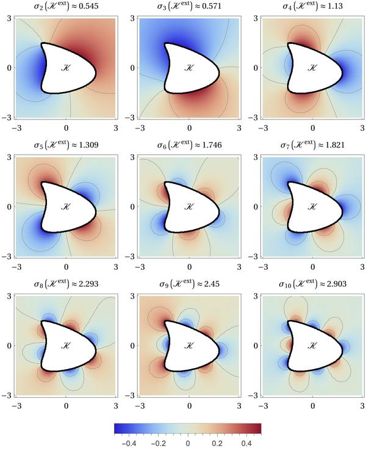
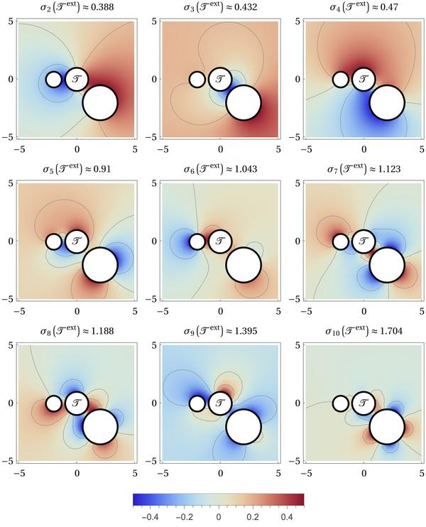

# exteriorsteklov
Scripts accompanying the paper [*The exterior Steklov problem for Euclidean domains*](https://michaellevitin.net/papers.html#exteriorS) by [Lukas Bundrock](https://math.ua.edu/people/lukas-bundrock), [Alexandre Girouard](https://agirouard.mat.ulaval.ca), [Denis S. Grebenkov](https://pmc.polytechnique.fr/pagesperso/dg/), [Michael Levitin](https://www.michaellevitin.net), and [Iosif Polterovich](https://www.dms.umontreal.ca/~iossif)
## Exterior Steklov problem for spheroids
### Files: 
* Mathematica notebook for spheroids [ExteriorSteklovSpheroids.nb](ExteriorSteklovSpheroids.nb)
* Mathematica notebook's printout  [ExteriorSteklovSpheroids.nb.pdf](ExteriorSteklovSpheroids.nb.pdf)
## Exterior Steklov problems for the kite and for the union of three disjoint disks
### Files: 
* FreeFEM script for the kite [ExteriorSteklovKite.edp](ExteriorSteklovKite.edp)
* FreeFEM script for the disks [ExteriorSteklovDisks.edp](ExteriorSteklovDisks.edp)
* Mathematica notebook for data processing and plotting [ExteriorSteklovKiteAndDisks.nb](ExteriorSteklovKiteAndDisks.nb)
* Mathematica notebook's printout [ExteriorSteklovKiteAndDisks.nb.pdf](ExteriorSteklovKiteAndDisks.nb.pdf)
* FreeFEM script for the interior problem in the kite [InteriorSteklovKite.edp](InteriorSteklovKite.edp)
### Extra figures:

